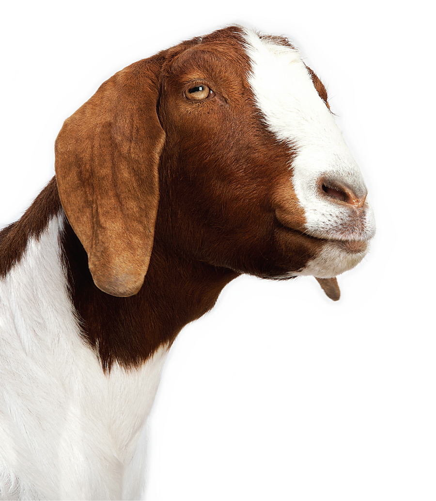

# Lexicon

## TL;DR

Create a program that compares the size of various rappers' lexicons.

## Background

### Rapper's Delight

Who's the GOAT? Jay-Z? Kanye? Kendrick? Drake?



One way to settle (or at least contribute to) the debate of the greatest rapper of all
time is to compare the size of the vocabulary used by each rapper. [Some people have looked
into this subject quite a bit already](https://pudding.cool/2017/02/vocabulary/). We're going to do a little research ourselves using Python! First, we're going to have to look at **sets**.

### Sets

In Python, the `set` data structure is like a list, but where duplicates are ignored. Let's say that you have a list of heights such as the one below:

```
heights = (5.5, 5.7, 5.8, 5.2, 5.5, 6.1, 6.0, 6.0)
```

In this list, 5.5 and 6.0 have duplicates. Thus when we make a set based on this list, the extra 5.5 and 6.0 will be omitted.

```
height_set = set(heights)
```

In this case `height_set` will be `{5.2, 5.5, 5.7, 5.8, 6.0, 6.1}`. Note the curly braces; these indicate that `height_set` is a set.

If I wanted to make a brand new set called `grades` containing the grade levels of CS50 Summer at HSA students, it would look like this:

```
grades = {6, 7, 8, 9, 10, 11, 12}
```
